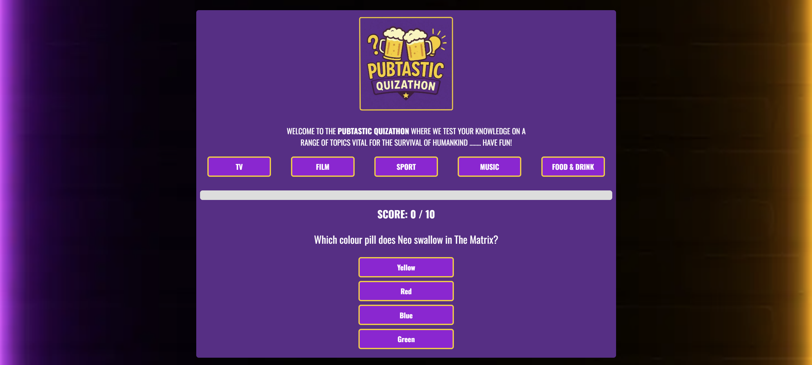
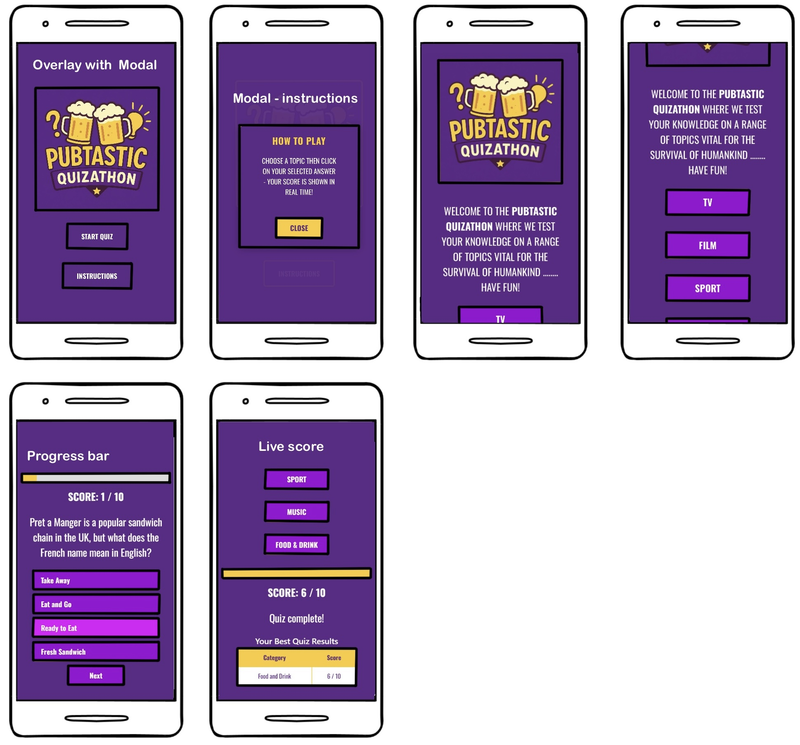
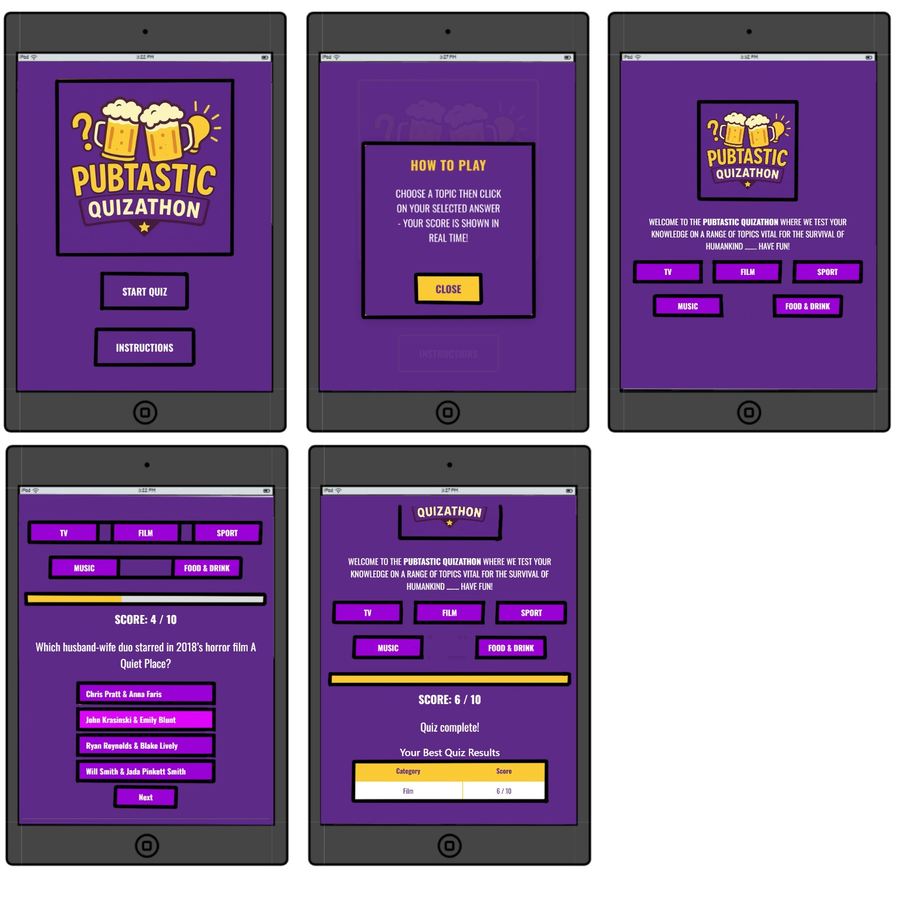
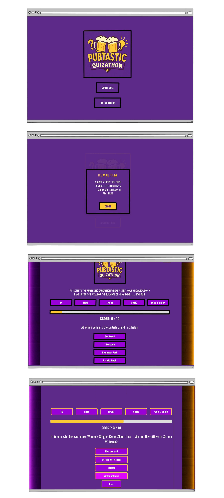
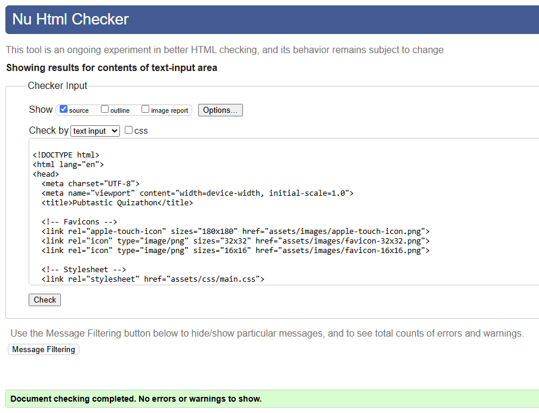
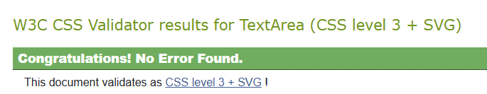
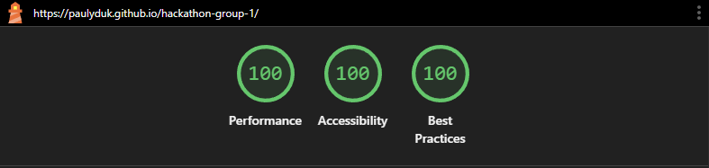
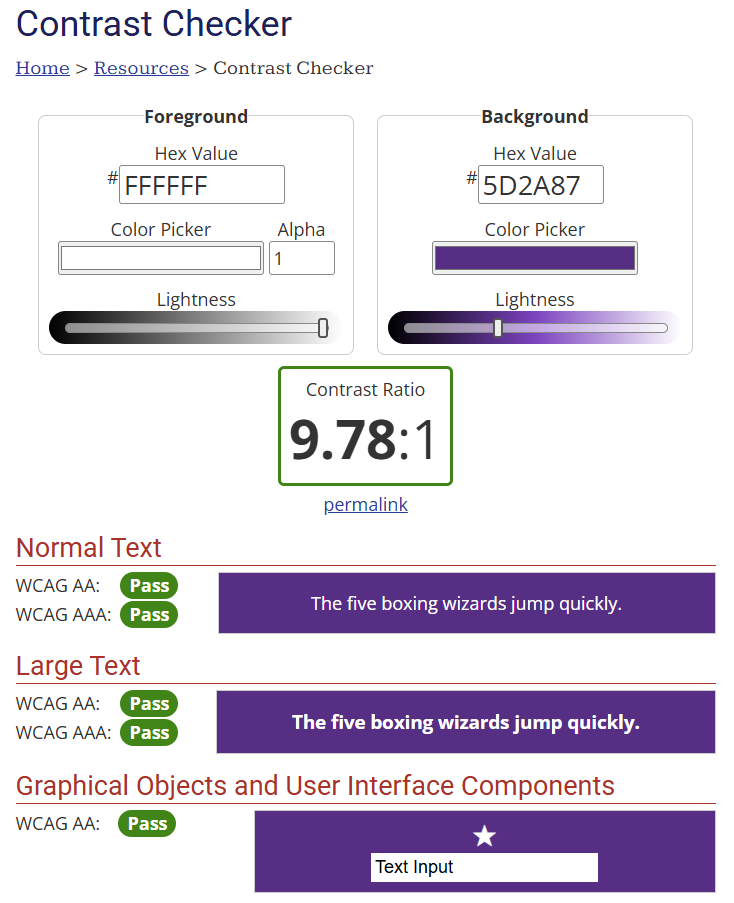

<h1 align="center" id="top">PubTastic Quizathon</h1>
 

 
<h2 align="center">Welcome to the readme of the PubTastic Quizathon, the first group hackathon for Code Institute</h2>
<h2 align="center"><a href="https://paulyduk.github.io/hackathon-group-1/">Website Link | <a href="https://github.com/users/PaulyDuk/projects/5">Project Board</a></h2>
<h1>Table of Contents</h1>
<ol>
<li><a href="#introduction">Introduction</a></li>
<ul>
<li><a href="#requirements">Requirements</a></li>
<li><a href="#structure">Structure & Concepts</a></li>
</ul>
<li><a href="#wireframes">Wireframes</a></li>
<ul>
<li><a href="#phone">Phone</a></li>
<li><a href="#tablet">Tablet</a></li>
<li><a href="#pc">Desktop</a></li>
</ul>
<li><a href="#user-stories">User Stories</a></li>
<li><a href="#design">UI/UX Design</a></li>
<li><a href="#features">Features</a></li>
<li><a href="#ai">AI Implementation</a></li>
<li><a href="#testing">Testing and Validation</a></li>
<ul>
<li><a href="#html-validation">HTML Validation</a></li>
<li><a href="#css-validation">CSS Validation</a></li>
<li><a href="#lighthouse">Lighthouse</a></li>
<li><a href="#contrast">Contrast Checker</a></li>
</ul>
<li><a href="#conclusion">Project Conclusion</a></li>
<li><a href="#credits">Credits</a></li>
</ol>

<h1 id="introduction">Introduction</h1>
This project is an assessed output that forms an element of the Code Institute Full Stack Software Developer Bootcamp and aims to demonstrate use of the technologies and methodologies set out during the delivery of the course to date. 
  

<h1 id="requirements">Requirements</h1>  
Collaboratively design and implement a one-page interactive front-end web application using HTML, CSS, and JavaScript focusing on user experience design, accessibility, and responsive DOM manipulation.
Application to meet accessibility guidelines and UX design principles; responsive front-end using flexbox/bootstrap, custom HTML and CSS with structured layout, navigation and graphics including semantic HTML and avoiding WCAG errors based on wireframes/mockups.
   
Include JavaScript allowing user control and feedback for effective DOM manipulation, dynamically updating the interface. JavaScript functionality including dynamic updates and user interaction. Effective DOM manipulation of at least two elements to reflect changes in real-time based on user actions.
All in accordance with global standards. 
  

<h1 id="structure">Structure & Concept</h1>
The application to be structured to provide:  
<ul>
    <li> an initial presentation of 'rules' and 'start' options to user;</li>
    <li>selection of 'rules' lanuches modal setting out how to play</li>
    <li>selection of 'start' launches selection of subject matter categories</li>
    <li>each category, on selection, launching a series of subject related multiple choice questions</li>
    <li>the user's score tallied in real-time as answers to each question are selected</li>
  </ul> 
 Upon completion of any particular category the user may select the same category to increase their score, or choose another category to play. The users score will show at the end of the quiz alongside their highest score for each category
  

<h1 id="wireframes">Wireframes</h1>
Wireframes were made for each display size and are shown below, these were later updated with the color scheme but the basic design did not change from our initial design
 
<h2 id="phone">Phone:</h2>
 

 
<h2 id="tablet">Tablet:</h2>
 

 
<h2 id="pc">Desktop:</h2>
 

  

<h1 id="user-stories">User Stories</h1>
<ul>
<li>As a user, I want to select an answer from multiple choices so that I can participate in the quiz easily.</li>

<li>As a user, I want to receive immediate feedback after answering a question so that I know if I was correct or not.</li>

<li>As a user, I want to see my total score at the end of the quiz so that I can measure my performance.</li>

<li>As a user, I want the quiz to be responsive so that I can play on both desktop and mobile devices.</li>

<li>As a user, I want to be able to restart the quiz so that I can try again and improve my score.</li>
</ul>
 

<h1 id="design">UI/UX Design</h1>
We decided to go for a bright colourful design to make the site appear more playful. Given we were working with a single page site we thought bold colours would be the best option to make it more vibrant and visually pleasing. We decided to go with a fade animation between the welcome page and the main content so it was not a jarring experience loading the quiz, we also used this fade animation between questions to keep consistency and provide pleasing visuals. We also decided to have the the main content of the quiz initially hidden until a quiz is selected, which is also true for the next button once a question had been answered. It was chosen that the bottom of the quiz container would smoothly accomodate this by expanding and contracting depending on the content on the page.
  
As users progress through the quiz a progress bar will show their progress through the 10 questions of the chosen category. It was decided that we would not add a previous/go-back button to avoid the user "cheating" the quiz to get the maximum score each time by going back to get the correct answer. This encourages the player to play again to improve their score.
  
The quiz results will also only show the best results of quizzes that have been completed and expand as new entries are added, keeping a clean design without additional clutter of quizzes not yet scored. We were mindful of this with the mobile first approach. 
  

<h1 id="features">Features</h1>
The site initially opens to a start and rules page, with the rules opening a modal to explain how to play. Once you click start quiz you are presented with the main interface of the quiz. There are several options for different categories and clicking on one will start the quiz with the question, answer, progress and score appearing below. There are 10 questions for each category and the score updates automatically as the user proceeds with the quiz, along with the progress bar.
  
Once the quiz has been completed it will show a quiz complete page and the score in a table for that particular quiz. At this stage the user can click on the quiz again and this will randomise the order of the questions, as well as the location of the answers so that people will not be able to memorise the order. The user can also choose a different category and run through the 10 questions. Once completed the result will be added to the table for that particular catergory. The best results table will only update if the user scores higher than their previous attempt, otherwise it will remain the same as the previous score.
  

<h1 id="ai">AI Implementation</h1>
The Pubtastic Quizathon used the team's skills in combination with AI in a number of key areas:
<ul>
<li>Imagery - the images were developed using a Freepik AI image and graphics generation account, iterating designs and color schemes to achieve the desired result.</li>
<li>Code Assistance - AI was used in different instances to support learning in the application of code in all areas as appropriate - this included HTML, CSS, and JavaScript. Iteration and defining clear concise prompts was critical for getting the correct assistance from AI</li>
<li>Debugging - AI was very useful in helping to identify the basis for areas where functionality was not as expected, and allowing different approaches or be used to eliminate those issues. It also served as a learning tool during that process when paricular code segments were not particularly clear.</li>
</ul>
AI is a fantastic tool but is not a replacement for a developer who does not understand the code that is generated. Duplicate segments of code had to be removed during iterations as well as moving inline CSS styles that it preferred to a separate CSS file.
  

<h1 id="testing">Testing & Validation</h1>
Continious deployment and testing was completed throughout the project lifecycle. By quickly deploying the project to Github pages we could instantly gain feedback on any issues that appeared. This continious development is vital as what we see locally is not always what appears when deployed online via Github. This also meant that our code was merged into the main branch for others to work from so we had a consistent baseline and to minimise any merge conflicts. Communication between the team was vital during these times. Testing was always done with a mobile first approach, before tablets and finally desktops. This was crucial as designing the quiz to work on mobile was the hardest initial challenge in regards to the layout and responsiveness of the site.
  

<h2 id="html-validation">HTML Validation</h2>
HTML Validation passes successfully with no errors:
  

 

<h2 id="css-validation">CSS Validation</h2>
CSS Validation passes successfully with no errors:
  

 

<h2 id="lighthouse">Lighthouse</h2>
Lighthouse scores a perfect 100% due to the lightweight design of the site:
  

 

<h2 id="contrast">Contrast Checker</h2>
Contrast checker passes for our text against our background:
  

  

<h1 id="conclusion">Conclusion</h1>
The design and format of the interactive Hackathon provides a unique opportunity for learners to take their first steps into collaborating on a project and getting to grips with Github as a collaborative tool. It also provides the group working together on the project the opportunity to hone their interpersonal skills, learn to interact co-operatively and supportively to enjoy their work time.
  
The group responsible for the Pubtastic Quizathon struck up a cordial but relaxed rapport that allowed each individual to contribute successfully to the whole; despite some initial teething problems with managing version control, the team ultimately learned a considerable amount surrounding the practicalities of working in teams and groups and how to consider approaches that minimise conflicts and enhance efficiency.
  
We particularly enjoyed learning this together and once the initial issues with merge conflicts was resolved we found it insightful to how we would work in teams in larger projects.
  

<h1 id="credits">Credits</h1>

- [Code Insitute](https://codeinstitute.net/) - For providing the training to build this website
- [Bootstrap](https://getbootstrap.com/) - For the responsive site layout tools
- [Flaticon](https://www.flaticon.com/) - Question mark icon by Freepik
- [favicon](https://favicon.io/) - Favicon generation
- [Google Fonts](https://fonts.google.com/) - Font library used
- [Sqoosh](https://squoosh.app/) - Used for image compression